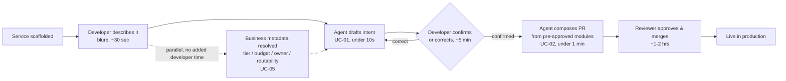
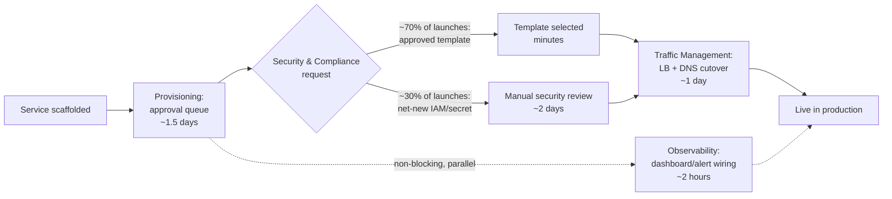
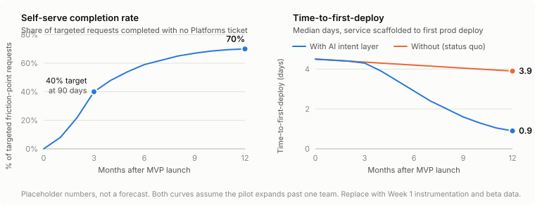
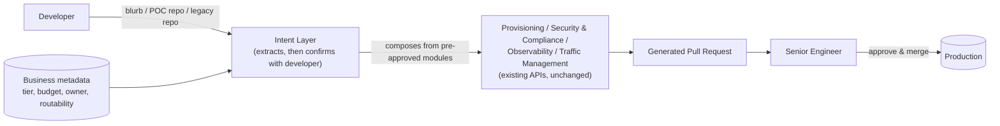

**Related:** [Opportunity brief](01-opportunity-brief.md), [event model](03-event-model.md), [GUI mockup](../mockups/index.html), [TUI mockup](../mockups/tui.html)

## Assumptions

Written from outside Yahoo, using its public Sr. PM, Platforms job posting and the case study brief, not internal access. The four underlying capabilities (Provisioning, Security & Compliance, Observability, Traffic Management) are the brief's own framing, not verified against Yahoo's actual architecture. Genuinely unknown from outside: whether team-level tier, budget, owner, and routability already exist as a queryable system of record anywhere in a real org; the real friction-point time costs (the table below is an illustrative worked example, not measured data); and whether "time to first deploy" is already tracked as a first-class metric.

# Part 1: Problem Formulation

## Abstract

Shipping a simple microservice requires hand-configuring four disconnected platform capabilities (Provisioning, Security & Compliance, Observability, Traffic Management), producing thousands of lines of bespoke boilerplate before any code reaches production. Each capability is mature and necessary on its own; nothing connects them, so every developer re-solves the same integration problem from scratch.

This PRD proposes an **AI Intent Layer**: a confirm-then-compose interface that turns whatever a developer already has, a blurb, a POC repo, or a legacy service, into pre-approved infrastructure configuration, scoped by business-set constraints (tier, budget, owner, routability) the developer never sets themselves, and reviewable as a diff before a human merges it. It starts on one input mode and one service tier, and earns broader scope later with real usage data.

This is the shape we're aiming for (diagram source: [diagrams/path-to-production-after.mmd](../diagrams/path-to-production-after.mmd); full before/after time-cost breakdown in [Where the friction actually is](#where-the-friction-actually-is)):

Every step that used to be a multi-day queue collapses to a sub-minute agent action or the one human step that was always going to exist anyway: a reviewer reading a PR.

That also answers the brief's hardest constraint directly: a hallucination in an infrastructure configuration can't reach production, because the agent never generates infrastructure configuration. It only ever selects from modules a human already approved, and a human still has to merge (FR-04, FR-06).

Mocked two ways, same mechanism, different surface, both branded **Shepherd** internally (see Internal adoption): [a GUI](../mockups/index.html) for reviewing and confirming, and [a CLI/TUI](../mockups/tui.html) for developers who'd rather not leave the terminal. Both mocks show all three input modes (blurb, POC repo, legacy repo), not just the blurb path.

## Industry context

Three things make this solvable now, not just desirable:

- **Platform engineering has gone mainstream, but most teams can't tell if it's working.** DORA's 2025 report puts internal-developer-platform adoption at 90% of organizations and dedicated platform teams at 76%, yet 29.6% of platform teams don't measure their own success at all, adoption without measurement is exactly the gap an intent layer's own metrics are built to close.
- **Consistency is a reliability lever, not a trade against velocity.** DORA's 2025 benchmark: elite performers deploy on demand, recover from failures 96x faster, and run change-failure rates 5x lower than low performers, largely because they've standardized what "deploying a service" means instead of hand-authoring it each time. That's the same mechanism this plan applies deliberately.
- **Propose-then-human-approves is already a proven pattern, just not yet applied to infrastructure.** GitHub reports roughly 30-40% suggestion acceptance for Copilot industry-wide. The same mechanism, an agent proposes, a human decides, is what this plan applies to infrastructure composition instead of code completion.

Sources: [DORA, Platform engineering capability](https://dora.dev/capabilities/platform-engineering/); [Cycloid, platform engineering KPIs](https://www.cycloid.io/blog/7-platform-engineering-kpis-you-should-be-tracking/); [GetPanto, GitHub Copilot statistics](https://www.getpanto.ai/blog/github-copilot-statistics); [ITPro, Copilot acceptance rate](https://www.itpro.com/technology/artificial-intelligence/github-30-of-copilot-coding-suggestions-are-accepted).

## Problem statement

A developer with a finished service still has to become a part-time expert in four unrelated systems before it reaches production: write Terraform for clusters and namespaces, hand-roll IAM policy and secrets, wire up dashboards and alert thresholds, and configure load balancers, DNS, and routing rules. That has three consequences:

- The same "stand up a Tier-2 service" problem gets re-solved by every team, producing as many slightly different configurations as there are engineers who've touched it, each a distinct source of drift and risk.
- Toil concentrates unevenly. Ranking the four capabilities against each other hides that; some of the worst individual steps sit inside one capability, some inside another, and the fix has to target steps, not categories (see below).
- Nothing prevents a developer's own self-report from setting things a platform can't safely let them set, risk tier, budget, which region they're allowed to touch, so any interface has to separate what the developer describes from what the business has already fixed.

**What success looks like for developers:** finishing a service and getting it correctly secured, observable, and live without opening a ticket or reading a Terraform doc, for the common case. Not that the AI writes any config, that the boilerplate disappears for the 80% case, and the 20% case still and always routes to a human.

## Where the friction actually is

As the PM here, the job is data gathering and analysis: find where friction actually concentrates, not assert it from a label. All four capabilities are necessary in the SDLC; none is optional, and the question isn't which one matters most. It's narrower: which specific, measurable step, inside any of them, costs the most developer time today.

This is a case study, so I only know what the prompt gives me. Rather than dress a guess up as a finding, I'm leading with the assumptions a worked example depends on, and treating the table below as a hypothesis to test, not a result:
- New services launch often enough that a slow step in Provisioning or Traffic Management compounds across many launches, not just one.
- A meaningful share of Security & Compliance requests are for a pattern that already has an approved template; a smaller share are genuinely novel.
- Observability setup is largely boilerplate once a service exists, so it's tedious more than it's blocking.

Given those assumptions, score each step on three axes:

| Friction point | Capability | Frequency | Time cost | Blocking | Illustrative score |
|---|---|---|---|---|---|
| Cluster/namespace provisioning approval queue | Provisioning | Every launch | ~1.5 days | Full | Highest |
| Load balancer + DNS cutover, manual sign-off | Traffic Management | Every launch | ~1 day | Full | High |
| Net-new IAM role or secret (non-templated request) | Security & Compliance | ~30% of launches | ~2 days | Full, for that subset | High, but narrow |
| Selecting an already-approved IAM/secrets template | Security & Compliance | ~70% of launches | Minutes | None | Low |
| Default dashboard/alert wiring | Observability | Every launch | ~2 hours | None | Low |

*(An illustrative worked example built on the assumptions above, not a claim about any real organization's numbers.)*

### Before: the path today

The same table as a path, with time cost attached to each step (diagram source: [diagrams/path-to-production.mmd](../diagrams/path-to-production.mmd)):

The solid path is critical: everything on it is blocking, so its time costs add serially, roughly 2.5 days on the template branch, closer to 4.5 if a net-new security request is needed. The dashed branch, Observability, runs in parallel and never gates "live in production," which is why it scores **None** on blocking severity despite being tedious. That distinction, blocking vs. parallel, is what a capability-level label can't show but a step-level path does. Whatever scores highest gets targeted first, whether that's one step inside a single capability or several spread across two; every capability stays necessary regardless of how its steps score, the score just says where to start.

### After: the same journey with an AI Intent Layer

Same start node, same destination, same four capabilities underneath, but the developer's own path through them collapses to a handful of steps (diagram source: [diagrams/path-to-production-after.mmd](../diagrams/path-to-production-after.mmd)):

Every step that used to be a queue, Provisioning's approval, Security's review, Traffic's cutover, is now either a sub-minute agent action or folded into the one human step that was always going to exist anyway: a reviewer reading a PR. The metadata lookup (dashed) runs the same way Observability did in the before path, in parallel, adding no developer time, except now it's a safety gate instead of a chore. Total critical path: roughly 1-2 hours, dominated entirely by the reviewer's own pace, not by waiting on four separate systems. That's the same order of magnitude as the "under 1 day" target in Success Metrics, with room to spare; the honest risk is that a reviewer's queue, not the agent, becomes the new bottleneck, which is exactly why "propose, never auto-merge" (FR-06) doesn't try to compress that step away.

## Inputs and data points

What I'd want to gather before committing further, in rough priority order:

| Input | Metric tracked | Data source |
|---|---|---|
| Deploy cycle time | Time from "service scaffolded" to first successful prod deploy | CI/CD event logs (build, PR, deploy events) |
| Platform ticket load | Ticket volume and category, auto-classified into topic buckets (IAM, LB/DNS, alerting, provisioning) | Jira/ServiceNow |
| Boilerplate novelty | Lines of hand-written Terraform/YAML per new service, and diff similarity to prior services | Git history across service repos |
| Config-attributable risk | Incidents and rollbacks tagged by root cause | Incident postmortems |
| Team-level metadata | Risk tier, budget ceiling, owner, routable regions, and whether each is queryable at all | Service catalog, cost/FinOps tool, org chart, network policy engine |
| Developer sentiment | Response rate and content of a one-question in-PR/in-IDE micro-survey | Lightweight, opt-in, non-blocking |

## Validating without disrupting sprints

Three low-friction layers, cheapest first: mine the signals above before talking to anyone, that alone shows the shape of the problem; then sample, not survey, pull 5-6 engineers who generated the highest-toil tickets in the data for a 20-minute conversation scheduled around their sprint, not inside it; then co-opt one team as the pilot instead of asking teams to validate a concept in the abstract, the MVP in Solution Definition *is* the validation.

The fastest way to learn if this actually solves the problem: does the pilot team choose to use it again on their next service without being told to. That's a stronger signal than a satisfaction survey, and it's the real gate on expanding past one team (see Release phases, P3).

## Personas

| Role | Job to be done | Pain | Success state |
|---|---|---|---|
| Maya, Product Engineer (Tier-2 service owner) | When I've finished a service, get it safely into production without becoming an infra expert | Has copy-pasted Terraform from the last similar service and caused one near-incident from a misconfigured security group she didn't fully understand | Describes her service once, confirms what the agent understood, merges a generated PR |
| Dev, Senior Platform Engineer (the skeptic) | When something touches production, see exactly what it will do before it does it, and be able to override it | Has hand-built workarounds for the platform's gaps for eight years; trusts what he can read and roll back, not what a model asserts | Every generated PR carries a plain-language rationale and an inspectable diff; nothing merges without his review |
| Sam, Platforms Lead (accountable for reliability) | When we accelerate developer velocity, don't do it by trading away my error budget | Owns the SLA for all four capabilities and answers for any incident traced to automation | Change-failure rate on generated config holds flat or improves as adoption climbs |

## Use cases

Ranked by leverage: impact on time-to-first-deploy vs. risk and effort to ship safely.

| Rank | Use case | Leverage | Notes |
|---|---|---|---|
| 1 | UC-01: Agent drafts intent from a blurb | Highest | High impact, low risk, draft only, nothing generated or changed at this step |
| 2 | UC-02: Agent composes a PR from the confirmed intent | High | Where the boilerplate actually disappears; still propose-only, no auto-merge |
| 3 | UC-03: Agent drafts intent from a POC repo | Medium | Same value as UC-01; reading arbitrary code reliably is a bigger engineering lift |
| 4 | UC-04: Agent drafts a modernization diff from a legacy repo | Medium | Narrower audience (teams modernizing an existing service); same risk profile as UC-03 |

- **UC-01** Agent parses a blurb against the team's fixed metadata (tier/budget/owner/routability) → `IntentExtracted` event, low-confidence fields flagged; never calls a provisioning API at this step.
- **UC-02** Agent selects modules from the confirmed intent, never the raw text → `ConfigurationComposed` event → opens a PR; denied at the policy-check step if the intent falls outside pre-approved patterns or a business-fixed constraint.
- **UC-03** Agent statically reads a POC repo, never executes it, for language/framework/dependencies → the same `IntentExtracted` event as UC-01, sourced from code instead of text.
- **UC-04** Agent diffs a legacy repo's existing IaC against current templates → proposes a modernization path as the same kind of PR, flagged as a diff, not a fresh deploy.

**Supporting use cases** (prerequisites and governance, not independently ranked): UC-05 the business's system of record sets or updates a team's metadata (tier, budget, owner, routable regions); UC-06 the developer confirms or corrects the agent's draft intent before composition can proceed; UC-07 a reviewer approves or requests changes on the generated PR, the only path to `ServiceDeployed`; UC-08 the platform records the deploy event, emitting the North Star metrics as a byproduct, not a separate manual measurement.

The [event model](03-event-model.md) diagrams UC-01, UC-02, and UC-05–UC-08 in full; UC-03/UC-04 follow the identical mechanism with a different extraction source and aren't separately diagrammed.

# Part 2: Solution Definition

## MVP vs. roadmap

**MVP:** blurb-to-intent extraction for one pilot team's Tier-2 stateless services; composition against that team's existing Terraform modules; automatic metadata lookup (tier, budget, owner, routable regions) from its system of record; propose-only PRs, no auto-merge.

**Beyond GA:** v1.1 POC-repo and legacy-repo ingestion (UC-03/UC-04); v1.1 narrowly-scoped auto-merge for the single lowest-risk field, after a quarter of clean proposal history; v2 expand past Tier-2 and past Python once the pattern is proven and reusable; v2+ a template-authoring workflow so Security/Platforms can add new approved patterns without an engineering release.

## Release phases

| Phase | Duration | Scope | Key risk |
|---|---|---|---|
| P0 | Week 1 | Instrument friction signals; confirm the pilot team's metadata is clean and queryable | Tier/budget/owner turns out to be tribal knowledge, not written down anywhere: reconciling it becomes its own workstream before any agent work starts |
| P1 | Week 2 | Build blurb-to-intent extraction + composition against the pilot team's Terraform modules; propose-only | Extraction misreads an ambiguous blurb: mitigated by the confirm-or-correct checkpoint, not by better prompting alone |
| P2 | Week 3 | Pilot team runs 2-3 real launches through it; every PR reviewed manually | Pilot team quietly reverts to hand-written Terraform: measure acceptance rate from day one, not just at the end |
| P3 | Week 4 | Measure against the team's own last 3 launches; decide expand or hold | Pressure to declare success before the sample size means anything: gate expansion on the measured signals, not the calendar |

Build is fast with AI assistance. Metadata cleanup, security review, and a real pilot team's willingness to use this on a live launch don't compress, so phases gate on those.

## Out of scope and non-goals

Deferred (each has a real trigger to revisit): POC-repo and legacy-repo ingestion (until the blurb path has a track record); auto-merge for any field (until a quarter of clean proposal history); expanding past Tier-2 or past Python (until the Tier-2 pattern is proven and reusable); a template-authoring workflow for Security/Platforms (until novel-but-recurring requests are common enough to justify one).

Not deferred, ruled out entirely, each would undermine the safety model itself: freeform generation of new IaC, or of net-new security/compliance policy, from scratch; letting a developer's own description set or override their team's tier, budget, owner, or routability; executing untrusted code from a POC or legacy repo to infer intent; any auto-merge without human review at launch.

## Connecting developer speed to business stability and cost

Speed and stability aren't in tension if the agent only recombines pre-vetted modules: every deploy that used to be hand-authored Terraform, a fresh source of drift and misconfiguration each time, becomes a deploy from the same small set of audited templates. Consistency *is* the reliability argument, not a trade against it (see Industry context). Cost follows the same logic two ways: standardized modules make right-sizing and reserved-capacity decisions tractable at the template level instead of renegotiating them service-by-service, and the budget ceiling in each team's fixed metadata (FR-02) catches an oversized request before it's provisioned, not after the bill arrives, the checkout-api example in both mockups is exactly that catch happening.

## Success metrics

If this works, the Platforms team's role changes: it stops being a routing layer for tickets and becomes a policy and composition layer, engineers self-serve the common path, and the team's time shifts to the judgment calls that actually need a human, new service tiers, exceptions, the automation itself. These are the metrics that would show it:

| Metric | Target | By when |
|---|---|---|
| Self-serve completion rate | 40% of targeted friction-point requests complete with no Platforms ticket | 90 days post-MVP |
| Self-serve completion rate | 70% | 12 months post-MVP |
| Time-to-first-deploy | Under 1 day, down from an illustrative ~4.5-day baseline | 12 months post-MVP |
| Change-failure rate (generated config) | At or below the manual-path baseline, every checkpoint | Ongoing from P2 |
| Agent proposal acceptance rate | Rising trend, starting below the ~30-40% Copilot benchmark | Tracked from P2 (first real PRs) |

**Hypothesis:** developers already want to skip the manual glue, but today's path forces them through four disconnected consoles regardless of how simple the service is. Removing that forced path compounds: every additional friction point the platform covers pulls self-serve completion up and time-to-first-deploy down together, because both metrics are driven by the same mechanism, fewer steps requiring a human before merge. The gap between the two time-to-deploy lines is the toil this plan removes; the baseline barely moves on its own because nothing else in the org is acting on it. All numbers are placeholders until Week 1 instrumentation and pilot data replace them.

## Internal adoption

Launched as a product aimed at skeptics, not a mandate: one credible senior engineer champions the pilot publicly, the pilot's real numbers get published internally and labeled as one team's data, and the tool ships under a discoverable name with runnable examples rather than a policy announcement. Internally this is **Shepherd**, not "the AI Intent Layer," a name people can say in Slack, and one that does some of the trust argument by itself: a shepherd guides the flock, it doesn't replace the shepherd's own judgment, and it never lets something wander off unsupervised (see the mockups for what that looks like on screen). Opt-in for two quarters before any team is required to use it; mandating an unproven tool to a team that has already built its own workarounds is how an initiative loses the trust it needs.

# Part 3: Technical Implications

Not a claim to a finished architecture, the brief itself says as much. This is detailed enough to defend the trust mechanism live, not to lock in an implementation before Week 1 even starts.

## How the intent layer and the four capabilities communicate

The agent never talks to Provisioning, Security & Compliance, Observability, or Traffic Management directly with anything it generated itself; it composes from each capability's existing API using modules a human already wrote, and a human still has to merge before anything reaches production.

Both the metadata lookup and the module composition happen before a human ever sees a PR; only the reviewer's merge can change production state, the structural guarantee behind the human-in-the-loop claim in Part 1.

## Functional requirements

- **FR-01 Extract a draft intent from any input mode:** blurb, POC repo, or legacy repo → `IntentExtracted` event; low-confidence fields flagged, nothing generated or changed.
- **FR-02 Resolve business metadata automatically:** developer's team identity → read-only lookup of tier, budget, owner, and routable regions from the system of record; never developer-editable.
- **FR-03 Require confirmation before composition:** only a `ConfirmIntent` command, not the raw extraction, can proceed to composition; a `CorrectIntent` loops back to extraction with the edit attached.
- **FR-04 Compose only from pre-approved modules:** the confirmed intent selects a Terraform/Crossplane module, IAM template, LB/DNS pattern, and dashboard default; no freeform IaC generation, ever.
- **FR-05 Flag business-constraint conflicts by name:** a developer-described value that would exceed budget or request a non-routable region surfaces as a named conflict, routed to an exception path, never silently resolved.
- **FR-06 Human-issued merge command:** only a reviewer's `ApprovePR` produces a `ServiceDeployed` event; no agent path can merge its own PR.
- **FR-07 Audit every generated config:** each PR is traceable to the intent record, the metadata snapshot, and the template version that produced it.
- **FR-08 Static-only code reading:** a POC or legacy repo is parsed, never executed, to infer intent.

## Non-functional requirements

- **Latency:** draft intent returned in under 10s for a blurb, under 60s for POC/legacy static analysis.
- **Availability:** matches the underlying capabilities' existing SLAs; the intent layer adds no new single point of failure to any capability it composes against.
- **Throughput:** rate-limited per developer/team, aligned to each capability's existing API limits, not pooled platform-wide.
- **Error rate:** 100% of out-of-policy compositions denied at the validation gate, zero tolerance for a generated PR that bypasses a business-fixed constraint.
- **Security:** static analysis only, no code execution; metadata lookups are read-only; every scoped action logged with the acting developer, team, and connection.
- **Compliance:** audit entries retained per the org's existing policy; generated IAM/secrets configs never exceed the pre-approved template's own scope.

## Trade-offs to work through with engineering

1. **Confirm every field vs. only low-confidence ones.** Confirming everything is safer but reintroduces the friction this plan removes; confirming only flagged fields is faster but risks a high-confidence extraction being wrong in a way the developer never catches.
2. **Read metadata at request time vs. cache it.** A live read is always current but adds a dependency and latency to every request; a cache is faster but risks composing against stale tier/budget data.
3. **One extraction model for all three input modes vs. a specialized one per mode.** One model is simpler to operate; parsing a blurb and statically reading a repo are different enough problems that a shared model may underperform either.
4. **Where the conflict-resolution exception path lives.** Routing a budget conflict straight to the team's owner keeps it fast but bypasses central review; routing it through Platforms is more consistent but reintroduces the ticket queue this plan exists to remove.

## Assumptions and constraints

**Hardest assumption:** that a developer will actually read and correct the "here's what I understood" summary rather than reflexively clicking confirm. If that's wrong, the confirm step becomes theater instead of a safety gate, and the fix isn't a better UI, it's tightening what's allowed to ship on template-selection alone versus what still requires a reviewer to independently catch the same error.

Constraints: builds on each capability's existing API/IaC interface, not a replacement; reads business metadata from wherever it already lives, never originates it; the MVP's Tier-2/Python/one-team scope is sized to a 4-5 engineer squad for one quarter, not a general-purpose platform.

## What I'd want to be wrong about

Two things this plan leans on hardest. First, that a hallucination never reaches production because the agent never generates infrastructure configuration, only selects from modules a human already approved, with a human still merging every change (FR-04, FR-06); if that boundary ever gets papered over for speed, the whole safety argument collapses with it. Second, that the four capabilities and the team-level metadata (tier, budget, owner, routability) already exist as queryable systems, not tribal knowledge; if they don't, this becomes a data-plumbing project before it's an agent project, and the six-month timeline moves right by however long that takes. I'd rather find out which of these is wrong in Week 1 (P0) than in Week 4.
