# Event Model: Intent to Production

*Narrates the mechanism behind the PRD's [use cases](02-prd.md#use-cases) and [functional requirements](02-prd.md#functional-requirements). Diagram source: [diagrams/event-model.mmd](../diagrams/event-model.mmd).*

Event modeling forces the gaps that prose hides: every state change needs a command that caused it, and every command needs a read model the actor could actually see before acting. Walking through it surfaces two checkpoints: one that makes an unstructured front door (a blurb, a POC repo, a legacy repo) safe to build on, and one that keeps business-set constraints (tier, budget, owner, routability) fixed rather than developer-editable.

## The flow

```mermaid
flowchart LR
    subgraph "Business metadata (fixed, looked up automatically)"
        Z0[Developer's team identity] --> Z1(Read: risk tier, budget, owner, routable regions)
    end
    subgraph Developer
        A[Maya submits a blurb, a POC repo, or a legacy repo] --> B(Command: SubmitIntentInput)
    end
    subgraph "Agent: extraction (draft, not decision)"
        B --> C[Read: NL parser or static code analysis]
        C --> D(Event: IntentExtracted)
        Z1 --> D
    end
    subgraph "Developer: confirm before anything acts"
        D --> E["Read: 'here's what I understood' + fixed team constraints + any conflicts"]
        E --> F(Command: ConfirmIntent / CorrectIntent)
        F -->|correct| C
    end
    subgraph "Agent: composition (never generation)"
        F -->|confirmed| G[Read: policy templates scoped by tier, budget, routable regions]
        G --> H(Event: IntentConfirmed)
        H --> I[Read: available Terraform/Crossplane modules]
        I --> J(Event: ConfigurationComposed)
        J --> K(Command: OpenPullRequest)
    end
    subgraph "Human review (never skipped)"
        K --> L[Read: generated diff + plain-language rationale]
        L --> M(Command: ApprovePR / RequestChanges)
    end
    subgraph Platform
        M -->|approved| N(Event: ServiceDeployed)
        M -->|changes requested| G
        N --> O[Read: dashboards, deploy event log]
        O --> P(Event: TimeToFirstDeployRecorded)
    end
```

## Walking the swimlanes

1. **Business metadata to Read.** The moment Maya's team identity is known (SSO, org membership), the platform looks up her team's risk tier, budget ceiling, owner, and routable regions from whatever system already owns each one. This has no command and no developer action: it's a lookup, not something she declares, and it happens whether or not she's aware of it.
2. **Developer to SubmitIntentInput.** Maya submits whichever of the three input modes she has: a blurb, a POC repo, or a legacy repo. Unlike a rigid form, there's no read model she needs beforehand: the burden of surfacing valid values moves to the next step instead.
3. **Agent to IntentExtracted.** The agent parses text or statically reads code (never executes it) and produces a candidate structured record, merging what Maya described with what her team's metadata already fixed. Low-confidence fields on her side are flagged; fields that come from metadata are never guessed, they're just read.
4. **Developer to ConfirmIntent / CorrectIntent.** The read model Maya needs *before* this command, a plain-language restatement of what the agent inferred, split visibly into "what you described" and "what your team's fixed constraints are," has to exist or she's confirming something she never saw. (This is the gap the model catches: the confirmation summary is a read-model dependency, not just a nicety, and it's what replaced the old rigid form as the safety checkpoint. It's also where a conflict, say, traffic that would exceed her team's budget, surfaces explicitly instead of being silently resolved one way or the other.) A correction loops back to extraction with her edit attached, not forward to composition with a guess.
5. **Agent to IntentConfirmed → ConfigurationComposed.** Only the *confirmed* record, developer-described fields plus business-fixed ones, never the raw blurb or code, drives module selection. The agent checks it against policy templates scoped by tier, budget, and routable regions; if it requests something outside pre-approved patterns or outside a fixed constraint, it fails here with a clear reason rather than falling through to generation. This is the enforcement point for the PRD's non-goals: no freeform IaC generation, and no developer-set override of business-fixed constraints, regardless of how unstructured the original input was.
6. **Agent to OpenPullRequest.** The PR body includes the rationale ("Tier-1, set by your team's metadata, maps to this IAM template, because…"), satisfying FR-07 (audit every generated config) before a human ever has to ask for it.
7. **Human to ApprovePR / RequestChanges.** This is the command that actually changes production state. The agent never merges its own PR. If changes are requested, the loop returns to composition, not to a different agent decision; the human's edit becomes the record of where the templates were wrong, which is itself a signal for template improvement.
8. **Platform to ServiceDeployed to TimeToFirstDeployRecorded.** The metric from the PRD's [success metrics table](02-prd.md#success-metrics) is emitted as a byproduct of the normal deploy event, not a separate manual measurement. The instrumentation from Week 1 (P0) of the MVP plugs in exactly here.

## What the model exposes that prose didn't

- **Business metadata needed its own swimlane, not a field in the intent form.** Putting tier/budget/owner/routability inside the same "read" step as NL parsing would have implied they're inferred alongside everything else. Modeling the lookup as a separate, developer-independent step is what makes explicit that these are never derived from what a developer says.
- **Unstructured input needed its own gate, not just the review at the end.** Without the `ConfirmIntent` step, the graph would have a direct edge from a guessed extraction straight into composition, exactly where a misread blurb or misunderstood repo turns into a wrong-but-plausible PR. Modeling it explicitly is what forced the "extraction is a draft, not a decision" rule into the design.
- **There is no state transition where the agent alone changes production.** Every path to `ServiceDeployed` passes through a human `ApprovePR` command, and every path to `ConfigurationComposed` passes through a human `ConfirmIntent` command. That's the concrete answer to "how do you prevent a hallucination from becoming an outage": it's not a policy statement, it's the only edges the graph has into those two nodes.
- **Rejection is a first-class event at both checkpoints, not an error case.** `CorrectIntent` and `RequestChanges` both feed back with a human edit attached, which is the mechanism for the extraction model and the templates to actually improve. Without modeling this explicitly, the plan reads like the agent gets one shot per request.
